# Multi-tenant SaaS on Amazon EKS - a walkthrough

> How one 24-line YAML file becomes an isolated, tiered, cost-attributed customer — and how it was verified.

Built hands-on via the AWS SaaS on Amazon EKS workshop. All screenshots below showcase live outputs from this environment—including terminal sessions, Argo CD resource trees, running tenant apps, and cost dashboards. Workshop instruction pages are omitted.

**Contents**

1. [The problem: Two customers, one codebase](#the-problem-two-customers-one-codebase)
2. [The shape: One cluster to manage, one to run](#the-shape-one-cluster-to-manage-one-to-run)
3. [Act 1: Teaching Kubernetes to speak AWS](#act-1-teaching-kubernetes-to-speak-aws)
4. [Act 2: One object, thirteen resources](#act-2-one-object-thirteen-resources)
5. [Act 3: Onboarding is a pull request](#act-3-onboarding-is-a-pull-request)
6. [Act 4: Isolation, and how to prove it](#act-4-isolation-and-how-to-prove-it)
7. [Act 5: Which customer is actually profitable](#act-5-which-customer-is-actually-profitable)
8. [Closing: What this is, and what it isn't](#closing-what-this-is-and-what-it-isnt)

A single-file version of this page, with every screenshot embedded and no network
dependency, is at [`saas-on-eks-story.html`](saas-on-eks-story.html) — download it
and open it in a browser, or print it to PDF.

---

## The problem: Two customers, one codebase

Every company that sells software to more than one customer eventually hits the same wall. Customer&nbsp;A and Customer&nbsp;B want the same product. Neither wants their data anywhere near the other's. One of them pays ten times more and expects that to mean something. And at the end of the month, somebody in finance asks which customer is actually profitable.

You can solve this by running a separate copy of everything per customer. It works, it isolates beautifully, and it bankrupts you &mdash; a hundred customers means a hundred databases, a hundred clusters, a hundred things to patch. Or you can run one shared copy and separate tenants in application code, which is cheap and fast until the day a <code>WHERE tenant_id = ?</code> gets forgotten and you are writing a breach disclosure.

This project is the middle path, made concrete. It is a working multi-tenant platform on Amazon EKS where the same container image serves every customer, but the boundaries between them are enforced by infrastructure &mdash; the Kubernetes scheduler, the network layer, and IAM &mdash; rather than by developer discipline. Cheap customers share. Expensive customers get their own. And which one a customer is comes down to a single word in a single file.

> **Why it matters** — Application-level tenant separation fails <em>silently</em>: the bug is a missing filter, and everything looks fine until it isn't. Infrastructure-level separation fails <em>loudly</em> &mdash; the request times out, the API call returns <code>AccessDenied</code>. The whole point of what follows is turning a class of quiet catastrophic bug into a noisy obvious one.

Here is the product. It is a number-guessing game, chosen because it is boring enough to not distract from the architecture, but it does touch everything a real SaaS app touches: a database for players and scores, object storage for avatars, and a generative-AI call for hints.

<p align="center">
  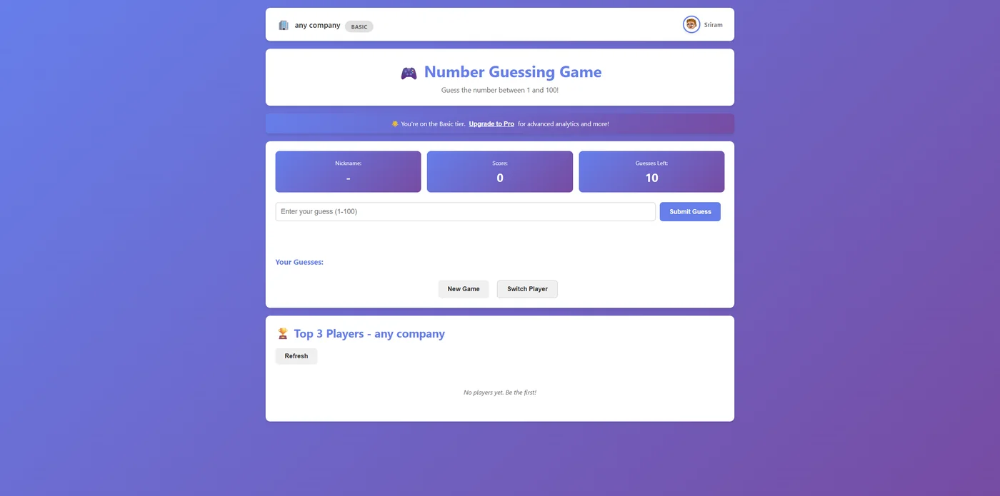
</p>

<p align="center"><sub>One tenant's view of the app. The tenant name, the <code>BASIC</code> badge, the upgrade prompt and the leaderboard are all resolved from tenant context at request time.</sub></p>

Now the same application, for a different customer, on a different URL:

<p align="center">
  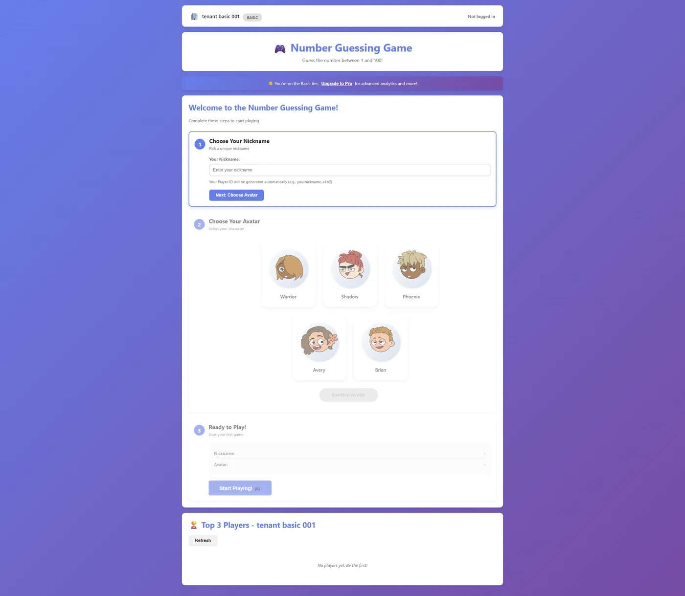
</p>

<p align="center"><sub>A different tenant, reached over a different load balancer. Same container image, same code path &mdash; different identity, different data, different leaderboard.</sub></p>

Same image. Same code. The tenant name in the header, the <code>BASIC</code> badge, the upgrade prompt, the leaderboard contents and &mdash; as we will see &mdash; which AI model answers, which database rows are reachable and which node the pod is even allowed to run on, are all derived from tenant context. Nothing is forked per customer.

## The shape: One cluster to manage, one to run

Before the walkthrough, the map. Two EKS clusters, each with one job.

<p align="center">
  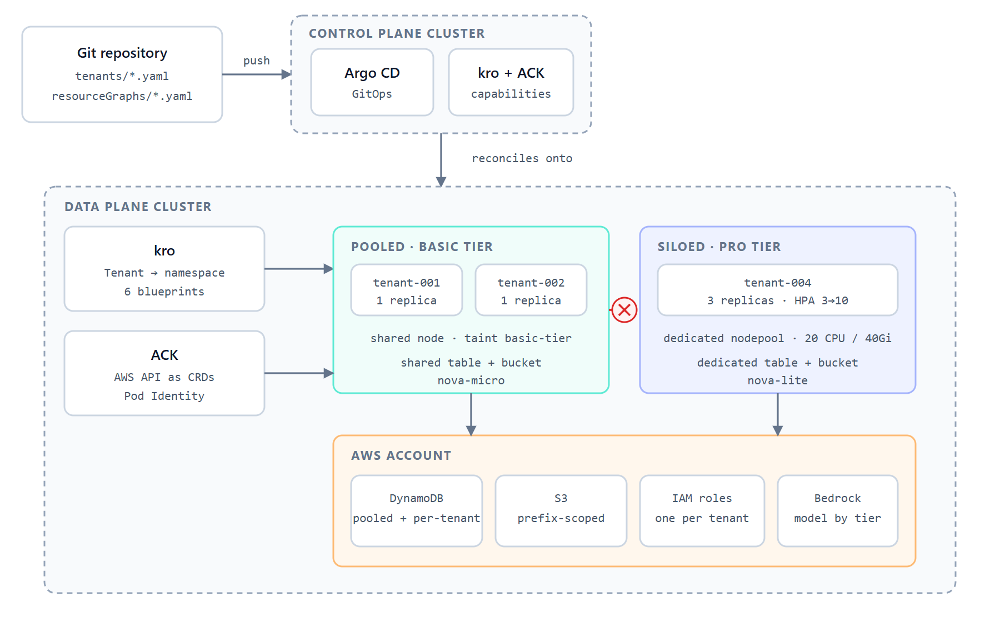
</p>

<p align="center"><sub>Control plane and data plane. Git is the only way in; kro expands blueprints into resources; ACK turns the AWS half into Kubernetes objects.</sub></p>

The split matters more than it looks. The <strong>control plane</strong> cluster holds Argo CD and never runs customer code. The <strong>data plane</strong> cluster runs customer code and holds no deployment machinery. A tenant that somehow escaped its namespace would find itself on a cluster with no credentials for, and no route to, the system that provisions tenants.

Both clusters run EKS Auto Mode, so nodes are Karpenter-managed and the <code>general-purpose</code> and <code>system</code> nodepools come built in:

<p align="center">
  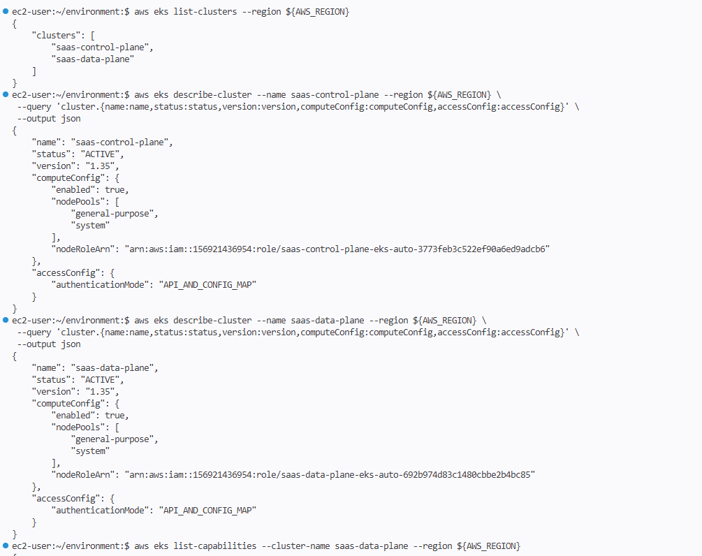
</p>

<p align="center"><sub>Two clusters, both on EKS Auto Mode &mdash; note <code>computeConfig.enabled: true</code> with the managed <code>general-purpose</code> and <code>system</code> nodepools.</sub></p>

The interesting part is what is installed on them. kro, ACK and Argo CD are not Helm charts here &mdash; they are <em>EKS capabilities</em>, AWS-managed and version-pinned:

<p align="center">
  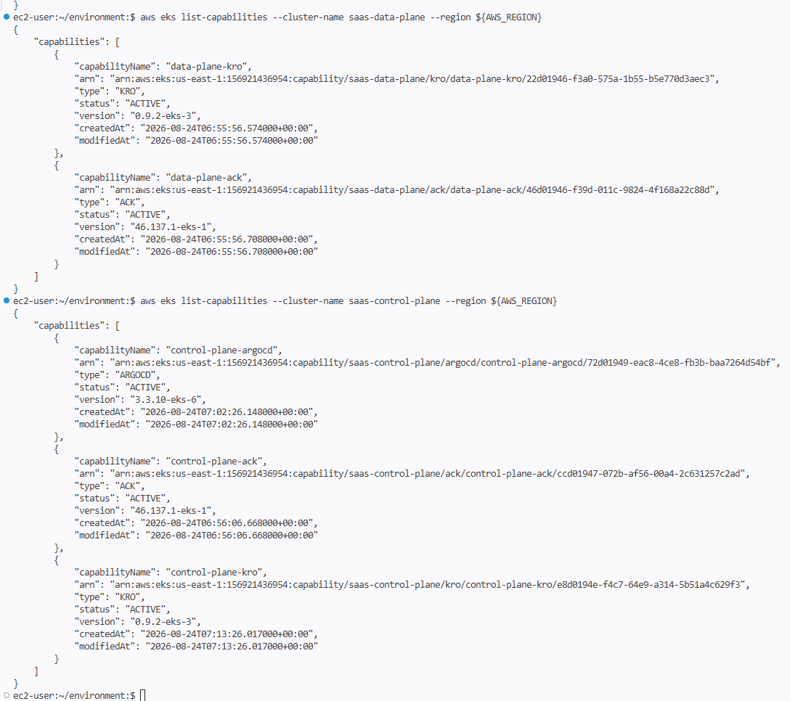
</p>

<p align="center"><sub>kro, ACK and Argo CD arrive as <em>EKS capabilities</em> &mdash; AWS-managed, version-pinned add-ons rather than Helm charts you install and then own forever.</sub></p>

> **Why it matters** — This is a small detail with a large consequence for a platform team. The three components the entire platform depends on are somebody else's upgrade problem. You get a version string and a support contract instead of three more repos to babysit.

And the whole system, viewed from one terminal &mdash; three repositories, two cluster contexts, two Argo CD applications, six blueprints:

<p align="center">
  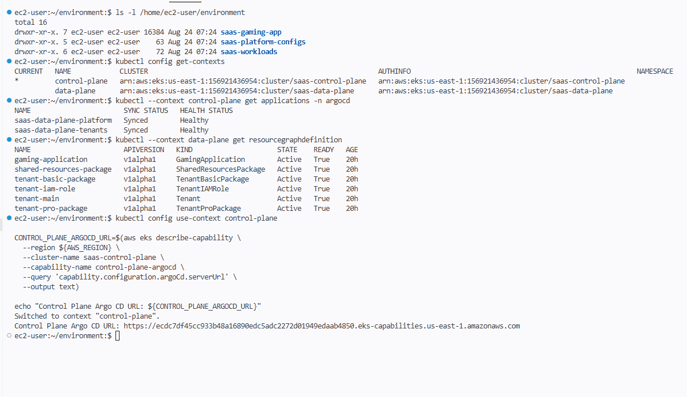
</p>

<p align="center"><sub>The whole platform in one screen: three repos, two contexts, two Argo CD applications, and the six ResourceGraphDefinitions that define what a tenant <em>is</em>.</sub></p>

Those two Argo CD applications are the only deployment path that exists. One delivers the platform's blueprints; the other delivers customers.

<p align="center">
  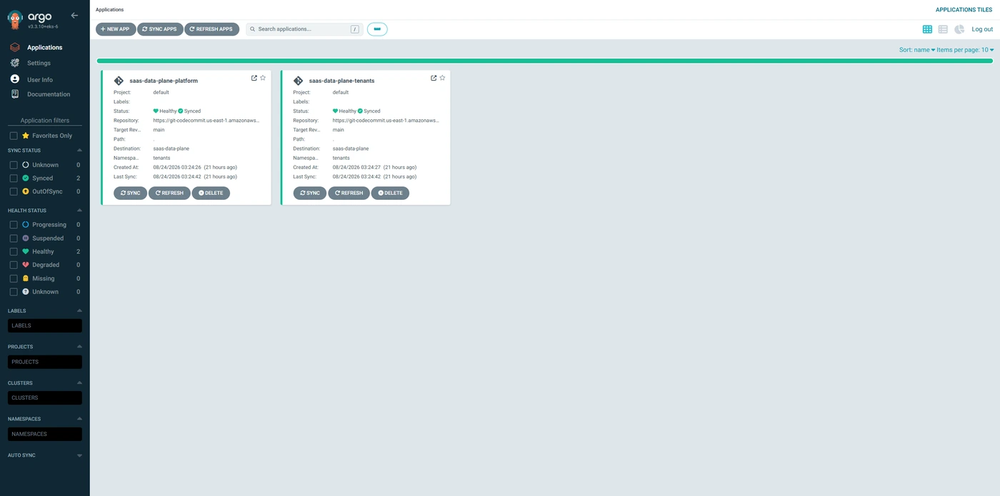
</p>

<p align="center"><sub>Two Argo CD applications, both tracking <code>main</code>. <strong>platform</strong> delivers the blueprints; <strong>tenants</strong> delivers the customers.</sub></p>

Expanding the platform application shows its entire job: keep six <code>ResourceGraphDefinition</code> objects in sync with git. These six definitions are what the rest of this page is about &mdash; they encode what the word "tenant" means at this company.

<p align="center">
  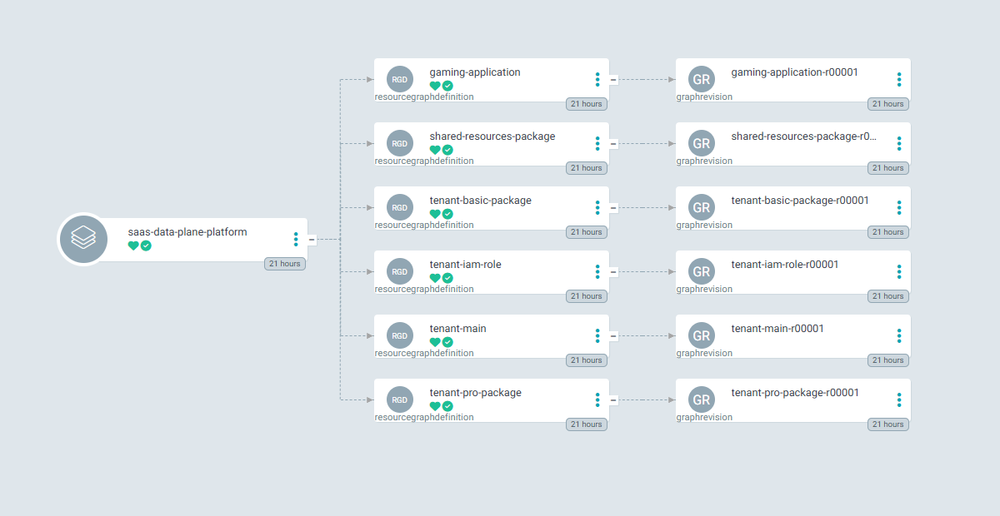
</p>

<p align="center"><sub>The platform application's only job is to keep six blueprints in sync. Each <code>ResourceGraphDefinition</code> gets a versioned <code>graphrevision</code> alongside it.</sub></p>

## Act 1: Teaching Kubernetes to speak AWS

Start from the ordinary. Here is the app deployed the way anyone would deploy it &mdash; a namespace, a deployment, a service, an ingress &mdash; running against mock data, with no AWS services behind it:

<p align="center">
  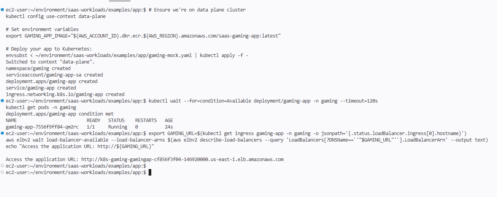
</p>

<p align="center"><sub>The starting point: a plain Kubernetes deployment backed by mock data. No AWS services yet &mdash; just something running.</sub></p>

The app needs a DynamoDB table, an S3 bucket, an IAM role and permission to call Bedrock. The conventional answer is Terraform or CloudFormation: a separate tool, a separate state file, a separate pipeline, and a gap between "the infrastructure exists" and "Kubernetes knows about it" that someone has to bridge by copying ARNs around.

<strong>AWS Controllers for Kubernetes (ACK)</strong> closes that gap by making AWS services into Kubernetes resources. Not references to them &mdash; the actual API, as CRDs:

<p align="center">
  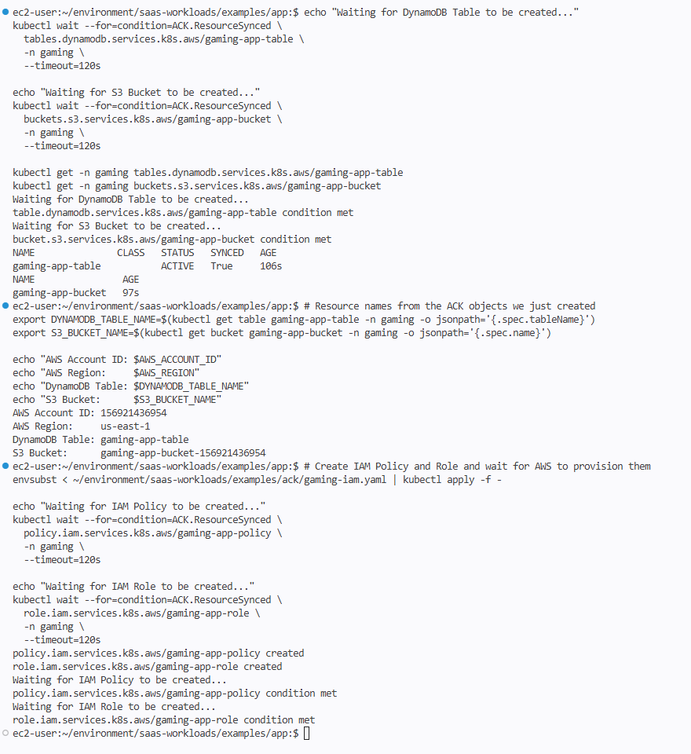
</p>

<p align="center"><sub>ACK installs CRDs for real AWS services. <code>tables.dynamodb.services.k8s.aws</code> is a DynamoDB table you can <code>kubectl apply</code>.</sub></p>

> **Why it matters** — <code>tables.dynamodb.services.k8s.aws</code> is a DynamoDB table you create with <code>kubectl apply</code>. That means one tool, one reconciliation loop, and one place to look. It also means AWS resources inherit Kubernetes semantics &mdash; owner references, finalizers, and deletion that actually cascades.

Because they are real Kubernetes objects they have real conditions, so you can block until the cloud has caught up. <code>ACK.ResourceSynced</code> is the load-bearing idea in this whole section:

```bash
kubectl wait --for=condition=ACK.ResourceSynced \
  tables.dynamodb.services.k8s.aws/gaming-app-table \
  -n gaming --timeout=120s
```

<p align="center">
  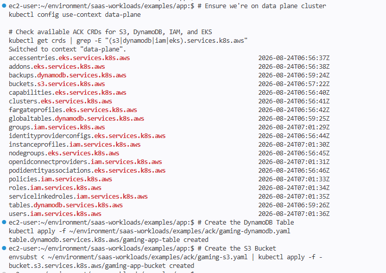
</p>

<p align="center"><sub><code>--for=condition=ACK.ResourceSynced</code> is the whole idea: Kubernetes waits until the real AWS resource actually exists.</sub></p>

The last piece is credentials, and it is the part most teams get wrong. No access keys are created here. Instead an <strong>EKS Pod Identity</strong> association ties the pod's service account to the IAM role, and the pod receives short-lived credentials it never has to store:

<p align="center">
  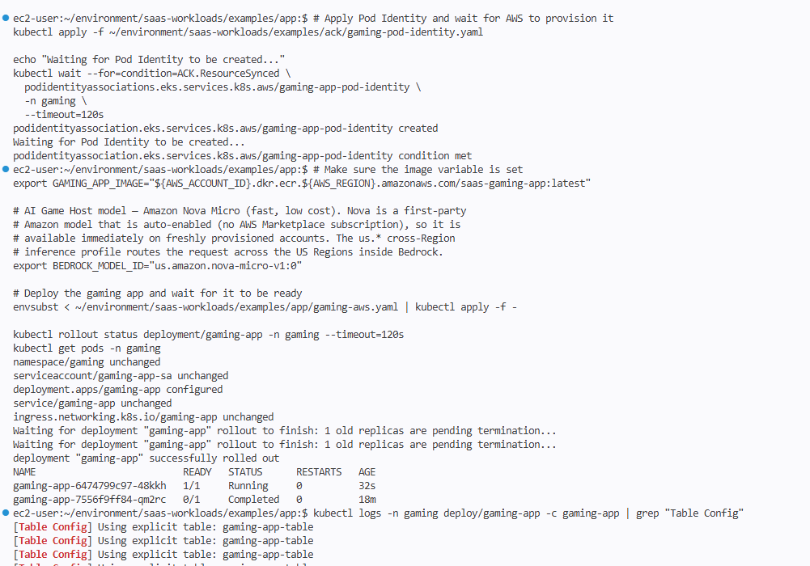
</p>

<p align="center"><sub>The last link: an EKS Pod Identity association binds the service account to the IAM role, so the pod gets AWS credentials with no static keys anywhere.</sub></p>

We now have the app talking to real AWS services with no static secrets. But look at what that cost: roughly a dozen separate <code>apply</code> and <code>wait</code> commands, in a specific order, with ARNs and names threaded between them by shell variables. Doing that once is a tutorial. Doing it per customer, correctly, forever, is a liability.

## Act 2: One object, thirteen resources

<strong>kro</strong> &mdash; the Kube Resource Orchestrator &mdash; solves the ordering-and-threading problem. You describe a graph of resources once, declare which fields flow from one into another, and kro derives the dependency order and gives you a brand-new custom resource type that stands for the whole graph.

The blueprint is a <code>ResourceGraphDefinition</code>. Applying one defines a new kind; creating an instance of that kind materialises everything:

<p align="center">
  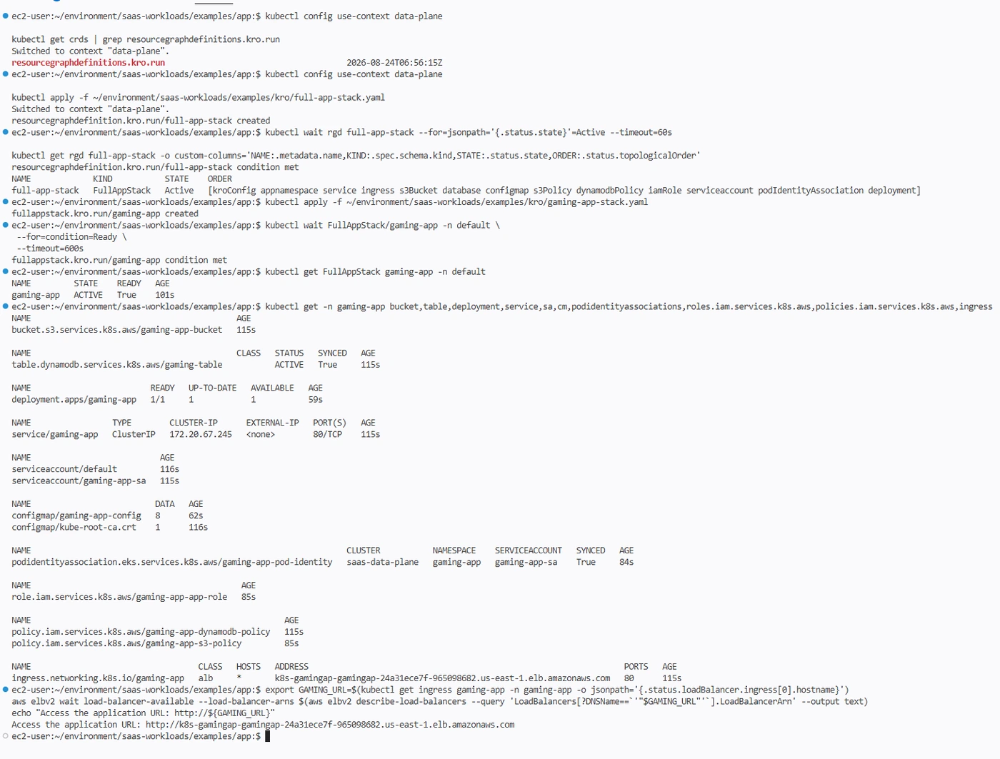
</p>

<p align="center"><sub>The payoff. One <code>FullAppStack</code> object becomes thirteen resources &mdash; Kubernetes <em>and</em> AWS &mdash; created in dependency order.</sub></p>

Read the <code>ORDER</code> field in that output. It is the topological sort kro worked out on its own:

```text
[kroConfig appnamespace service ingress s3Bucket database configmap
 s3Policy dynamodbPolicy iamRole serviceaccount
 podIdentityAssociation deployment]
```

> **Why it matters** — Nobody wrote that order down. kro inferred it from the data dependencies &mdash; the IAM role must exist before the Pod Identity association can reference it, the bucket must exist before a policy can name its ARN. Encoding dependencies as data rather than as script line-order is what makes this safe to run a thousand times.

One object produced a namespace, deployment, service, ALB ingress, two service accounts, two configmaps, an S3 bucket, a DynamoDB table, an IAM role, two IAM policies and a Pod Identity association. Verifying from inside the running pod, the resource names were wired in for us:

<p align="center">
  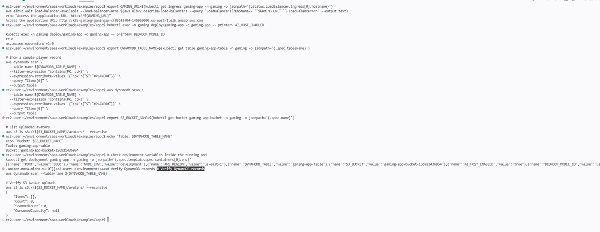
</p>

<p align="center"><sub>Verification from inside the pod. The table and bucket names were wired in by kro, not by hand.</sub></p>

And because kro owns the graph, teardown is symmetric. One delete, and the AWS resources go too &mdash; while the platform blueprints stay put:

<p align="center">
  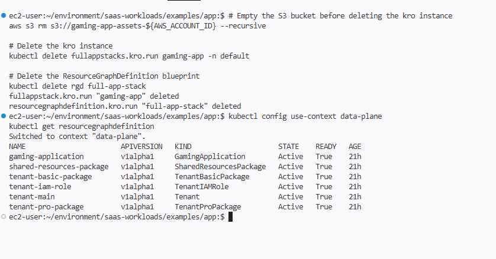
</p>

<p align="center"><sub>One <code>delete</code> reclaims the whole stack, AWS resources included. The six platform blueprints are untouched.</sub></p>

This is the hinge of the whole project. We have gone from "a dozen careful commands" to "one object". A one-object abstraction is something you can safely hand to an onboarding pipeline.

## Act 3: Onboarding is a pull request

Here is the entire contract for a paying customer. Twenty-four lines:

<p align="center">
  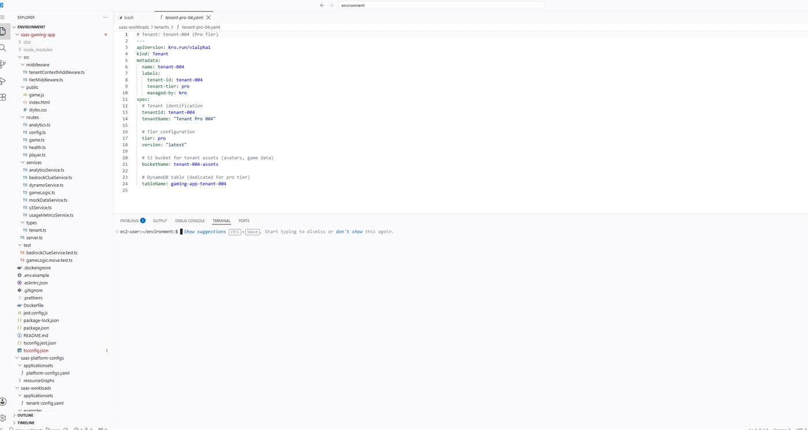
</p>

<p align="center"><sub>This is the entire customer contract. Twenty-four lines, one of which &mdash; <code>tier: pro</code> &mdash; decides the whole shape of the infrastructure.</sub></p>

```yaml
apiVersion: kro.run/v1alpha1
kind: Tenant
metadata:
  name: tenant-004
  labels:
    tenant-id: tenant-004
    tenant-tier: pro
spec:
  tenantId: tenant-004
  tenantName: "Tenant Pro 004"
  tier: pro                          # <-- the entire tiering decision
  version: "latest"
  bucketName: tenant-004-assets
  tableName: gaming-app-tenant-004
```

The <code>tenant-main</code> blueprint reads <code>spec.tier</code> and routes to one of two packages. <code>TenantBasicPackage</code> puts the customer onto shared infrastructure. <code>TenantProPackage</code> gives them their own. Same input kind, two very different outputs.

> **Why it matters** — This is the commercial model expressed as code. Sales sells a tier; the tier is a string in a YAML file; the string selects a blueprint; the blueprint decides whether the customer shares a node and a database or gets dedicated ones. Nobody translates a contract into infrastructure by hand, which is exactly where that translation usually goes wrong.

### The pooled path

Basic tenants share. First the shared pool is created, then three tenants are onboarded &mdash; by committing three files:

<p align="center">
  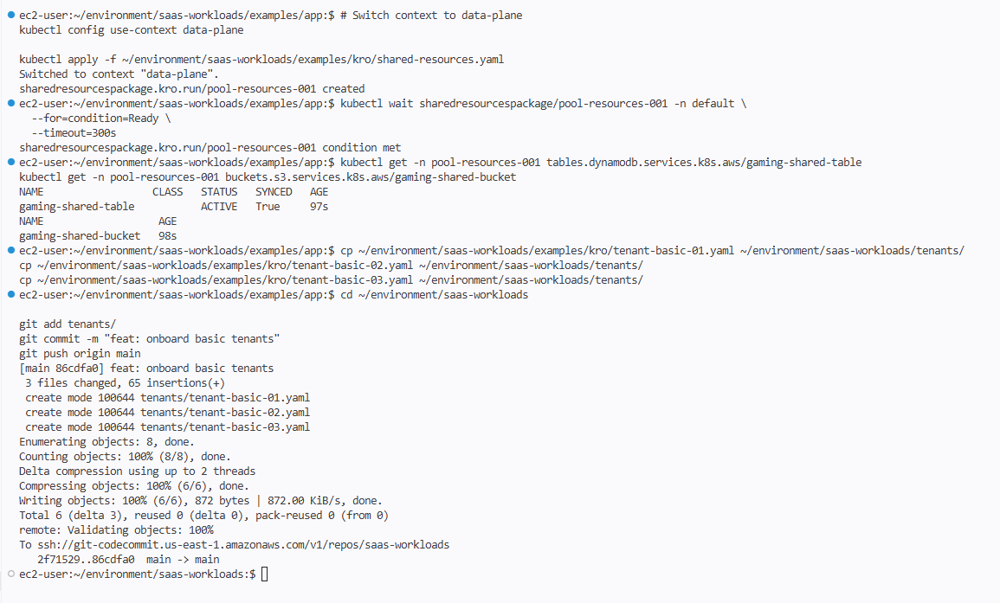
</p>

<p align="center"><sub>First the shared pool, then three tenants onto it &mdash; onboarded by <code>git push</code>, not by a console click.</sub></p>

Argo CD notices the commit and reconciles. Each <code>Tenant</code> expands into a namespace, a workload, an ingress, an IAM role and three scoped policies, and then serves traffic:

<p align="center">
  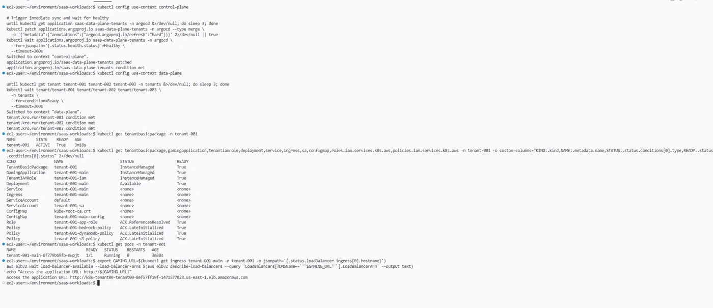
</p>

<p align="center"><sub>From one committed file: a namespace, a workload, an ingress, an IAM role and three scoped policies &mdash; then a URL that serves traffic.</sub></p>

### The dedicated path

Change one word and commit again. <code>tier: pro</code> selects <code>TenantProPackage</code>, which brings resources the Basic package never creates &mdash; an autoscaler, a dedicated bucket, a dedicated table:

<p align="center">
  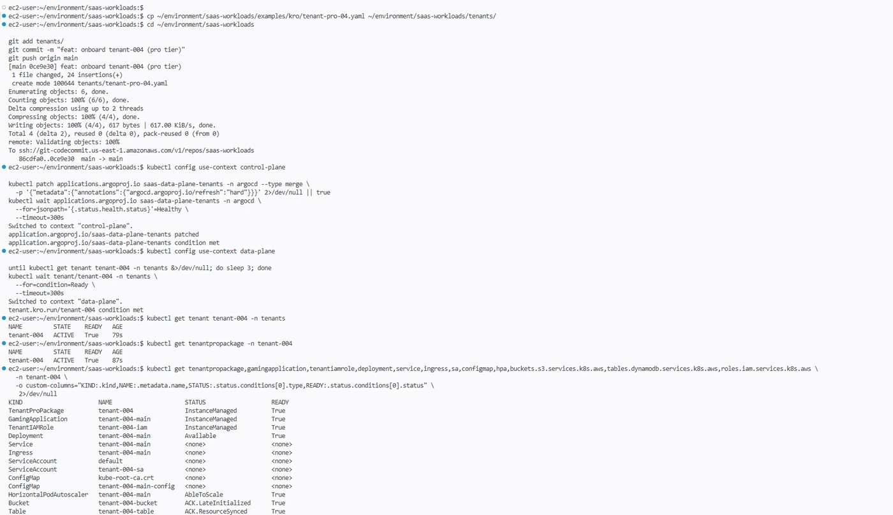
</p>

<p align="center"><sub>Same <code>kind: Tenant</code>, but <code>tier: pro</code> routes to <code>TenantProPackage</code> &mdash; which brings an HPA, a dedicated bucket and a dedicated table.</sub></p>

Every tier promise, verified:

<p align="center">
  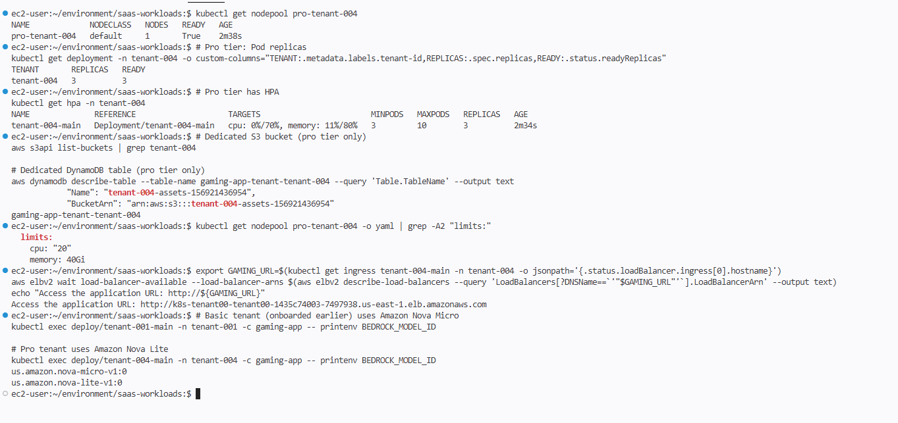
</p>

<p align="center"><sub>Every tier promise, verified in one screen &mdash; ending with the difference that costs real money: <code>nova-micro</code> for Basic, <code>nova-lite</code> for Pro.</sub></p>

- <strong>Dedicated nodepool</strong> <code>pro-tenant-004</code>, capped at 20 CPU and 40Gi &mdash; a hard ceiling on blast radius as much as on spend
- <strong>3 replicas</strong> instead of 1, so a single node failure is not an outage
- <strong>HPA scaling 3&nbsp;&rarr;&nbsp;10</strong> on 70% CPU / 80% memory targets
- <strong>Dedicated</strong> S3 bucket and DynamoDB table rather than a shared table with tenant-prefixed keys
- <strong>A better AI model</strong> &mdash; <code>nova-lite</code> for Pro against <code>nova-micro</code> for Basic

That last one is the most interesting, because it is the tier difference that maps most directly to a per-request cost. And as the next section shows, it is enforced in IAM &mdash; a Basic tenant cannot invoke the Pro model even if the application code asked it to.

Zoomed out, the customer list is now a git history:

<p align="center">
  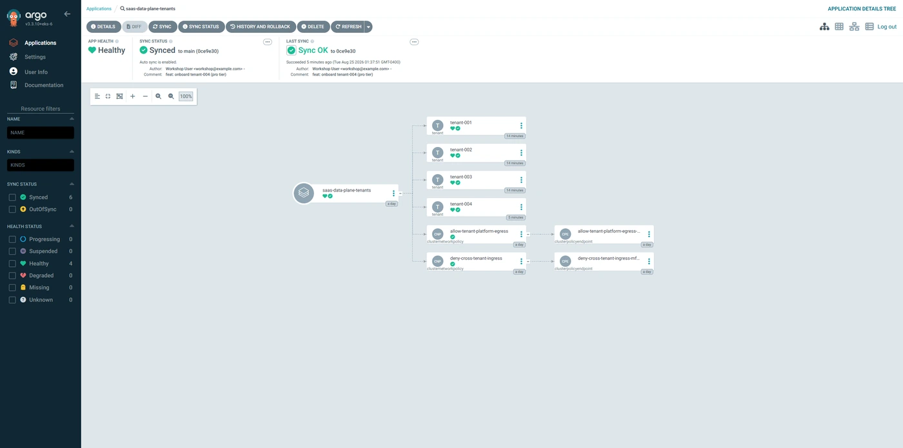
</p>

<p align="center"><sub>Four tenants and the cluster-wide guardrails, all reconciled from the commit named in the header. The customer list is a git history.</sub></p>

> **Why it matters** — Onboarding is a commit, so it inherits everything git already gives you: review before a customer is created, attribution for who created them, and rollback by revert. Offboarding is deleting a file. There is no separate provisioning system to keep honest, because git <em>is</em> the provisioning system.

## Act 4: Isolation, and how to prove it

Everything up to here was construction. This section is the part that matters, because an isolation claim you have not tried to break is not a claim, it is a hope.

So each of the four boundaries below is demonstrated by a command that is <em>supposed to fail</em>. The failures are the evidence.

### 1. Compute &mdash; who shares a machine

Basic tenants are packed onto shared nodes; the Pro tenant gets its own. Karpenter nodepool taints make that structural rather than best-effort:

<p align="center">
  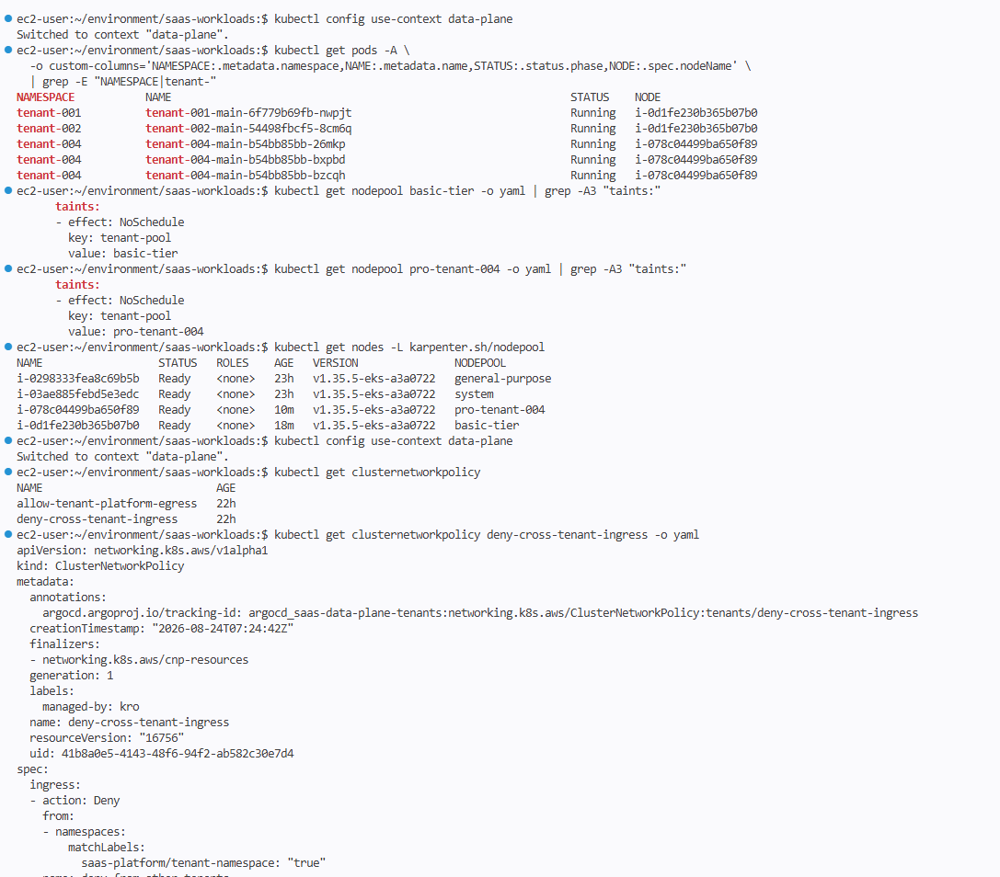
</p>

<p align="center"><sub>Pooled Basic tenants share a node; the Pro tenant gets its own. Karpenter taints make that structural rather than advisory.</sub></p>

<code>tenant-001</code> and <code>tenant-002</code> sit on one node. <code>tenant-004</code>'s three pods sit together on a different node, reachable only by workloads that tolerate <code>tenant-pool=pro-tenant-004:NoSchedule</code>. A Basic tenant's pod cannot land on the Pro tenant's hardware because the scheduler will not place it there.

### 2. Network &mdash; who can reach whom

The real test. From inside a pod in <code>tenant-001</code>, reach for <code>tenant-002</code>'s service on its ClusterIP. Both namespaces are on the same cluster, the address resolves, the service is listening:

<p align="center">
  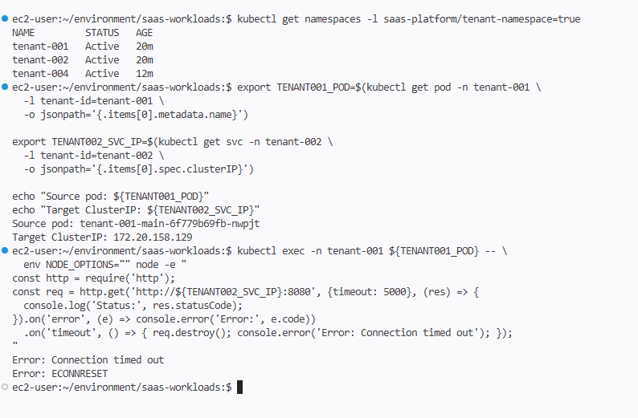
</p>

<p align="center"><sub>The most important screenshot here. A pod in <code>tenant-001</code> reaches for <code>tenant-002</code>'s service and gets nothing back.</sub></p>

> ⛔ **DENIED** — <code>tenant-001</code> &rarr; <code>tenant-002</code> ClusterIP:8080 &mdash; <code>Connection timed out</code>, then <code>ECONNRESET</code>

Note the failure <em>mode</em>: a timeout, not a refusal. The packets are dropped rather than rejected, so a hostile tenant cannot even use connection behaviour to map its neighbours.

Egress is an allowlist too. S3 answers; the open internet does not:

<p align="center">
  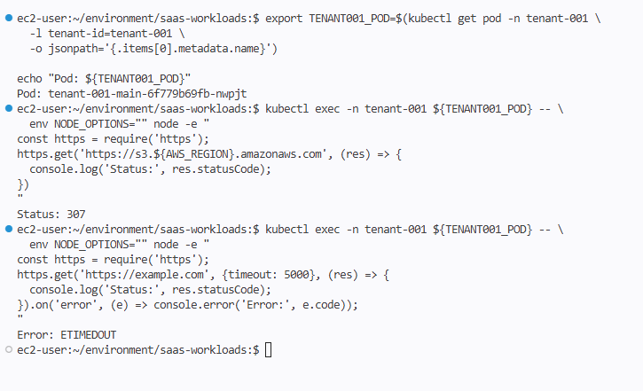
</p>

<p align="center"><sub>Egress is an allowlist, not a firewall afterthought: S3 answers, the open internet does not.</sub></p>

> ✅ **ALLOWED** — <code>https://s3.us-east-1.amazonaws.com</code> &mdash; <code>Status: 307</code>
>
> ⛔ **DENIED** — <code>https://example.com</code> &mdash; <code>ETIMEDOUT</code>

Both results come from one policy, generated per tenant by kro rather than hand-maintained &mdash; note <code>managed-by: kro</code> and the domain-name allowlist:

<p align="center">
  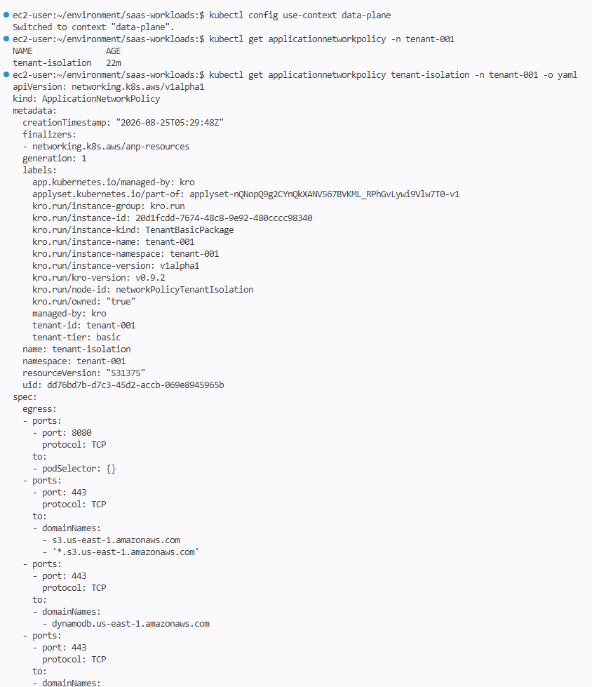
</p>

<p align="center"><sub>The rule behind the two results above &mdash; and note <code>managed-by: kro</code>. Nobody hand-wrote this per tenant.</sub></p>

> **Why it matters** — Egress filtering is the control that turns a code-execution bug into a contained incident. An attacker who achieves RCE inside a tenant pod finds they cannot reach their own command-and-control server, cannot curl a payload in, and cannot exfiltrate to anywhere but the four AWS endpoints the tenant legitimately needs.

### 3. Identity and data &mdash; whose rows are whose

Network isolation is not enough on its own, because tenants share AWS services that live outside the cluster. Two tenants using the same DynamoDB table need a boundary that the network layer cannot see. That boundary is IAM: each tenant gets its own role, delivered by Pod Identity, with policies scoped to its own data.

<p align="center">
  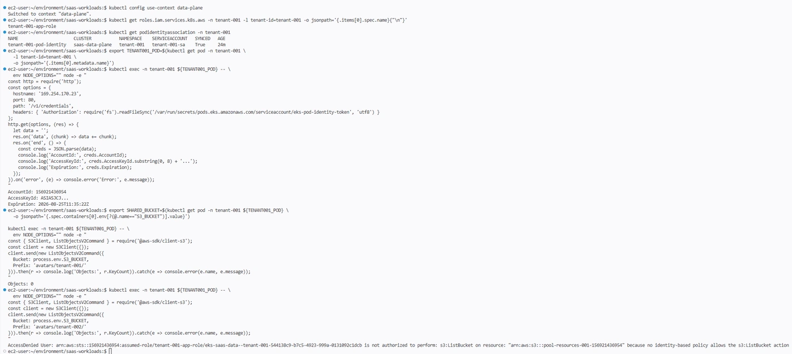
</p>

<p align="center"><sub>Credentials with no static keys, scoped per tenant. Its own prefix: fine. Its neighbour's prefix: <code>AccessDenied</code>.</sub></p>

> ✅ **ALLOWED** — list <code>avatars/tenant-001/</code> from the <code>tenant-001</code> pod &mdash; <code>Objects: 0</code>
>
> ⛔ **DENIED** — list <code>avatars/tenant-002/</code> from the same pod &mdash; <code>AccessDenied</code>

Same bucket, same code, same SDK call &mdash; one prefix works and the neighbour's does not. Then the same test against the shared DynamoDB table, plus the tier boundary:

<p align="center">
  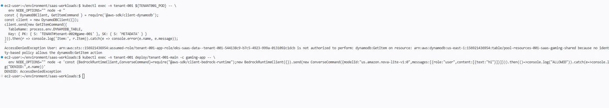
</p>

<p align="center"><sub>Two boundaries in one screen: a tenant cannot read its neighbour's row, and a Basic tenant cannot reach the Pro tier's model. Both refused by IAM, not by app code.</sub></p>

> ⛔ **DENIED** — <code>GetItem</code> on <code>TENANT#tenant-002#game-001</code> from <code>tenant-001</code> &mdash; <code>AccessDeniedException</code>
>
> ⛔ **DENIED** — Basic tenant invoking the Pro model <code>us.amazon.nova-lite-v1:0</code> &mdash; <code>AccessDeniedException</code>

> **Why it matters** — That second denial is the one to dwell on. The tier isn't enforced by a feature flag the application checks &mdash; it is enforced by the credentials the pod holds. A bug in the tier middleware, or an attacker who fully controls the Basic tenant's process, still cannot invoke the expensive model. The billing boundary and the security boundary are the same boundary.

### 4. Runtime &mdash; how much damage one tenant can do

The last boundary is the noisy-neighbour problem, which is what makes pooled tenancy frightening. Pod Security Standards are enforced at the namespace level, and quotas cap what a tenant can consume:

<p align="center">
  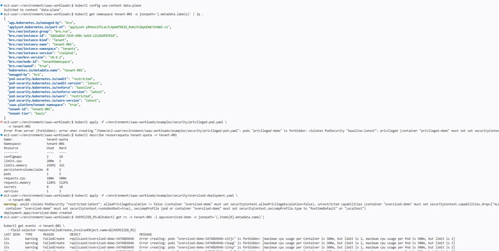
</p>

<p align="center"><sub>Runtime limits, enforced by the API server. Note the last block: the Deployment is accepted, but no pod is ever allowed to exist.</sub></p>

> ⛔ **DENIED** — privileged pod in <code>tenant-001</code> &mdash; <code>Forbidden: violates PodSecurity "baseline:latest"</code>
>
> ⛔ **DENIED** — oversized deployment &mdash; admitted, but every pod blocked: <code>maximum cpu usage per Container is 500m</code>

The oversized-deployment case is a nice illustration of layered defence. The <code>Deployment</code> object is accepted &mdash; it is just a spec &mdash; but the <code>LimitRange</code> stops every pod the ReplicaSet tries to create, and the failure surfaces as events rather than as a node quietly filling up.

> **Why it matters** — Four independent layers, and no single one of them is load-bearing on its own. Break the network policy and IAM still refuses. Break IAM and the network still drops the packets. Compromise the container and Pod Security blocks the escape. That redundancy is the difference between a demo and something you would put a real customer on.

## Act 5: Which customer is actually profitable

One question is left, and it is the one that decides whether the pooled model was a good idea: what does each customer cost to serve?

This is genuinely hard in shared infrastructure. A node runs pods from three tenants plus system daemons; the EC2 bill is one line item. Split cost allocation solves it by apportioning each node's cost across the pods that ran on it, weighted by what they actually requested and used. Because every tenant here already has its own namespace and consistent <code>tenant-id</code> labels, that data has somewhere to land:

<p align="center">
  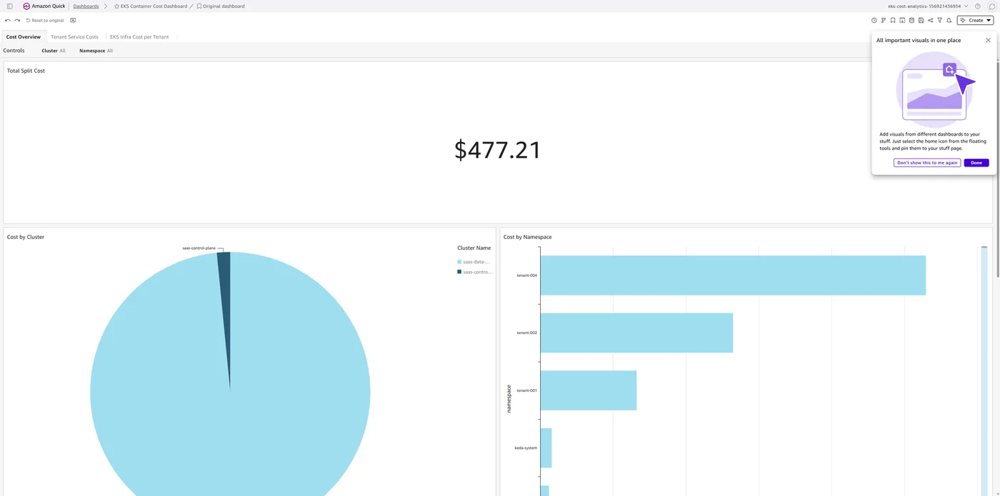
</p>

<p align="center"><sub>The question every SaaS finance team asks, finally answerable: <code>tenant-004</code> costs more than <code>tenant-001</code>, and here is the number.</sub></p>

<code>tenant-004</code> &mdash; the Pro tenant, with its dedicated nodepool and three replicas &mdash; costs visibly more than the pooled Basic tenants below it. Which is the correct and expected answer, and that is precisely the point: the architecture and the invoice tell the same story.

> **Why it matters** — Per-tenant cost turns architecture decisions into business decisions. You can price a tier from measurement rather than guesswork, find the customer on a cheap plan who is quietly consuming a fortune, and answer "should this customer be pooled or dedicated?" with a number. Without it, multi-tenancy is a bet you never get to settle.

## Closing: What this is, and what it isn't

The platform above genuinely works, and the failures are genuinely enforced. But it was built by following a workshop, and it would be dishonest to present it as production-ready. The gaps worth naming:

- <strong>Single region.</strong> No multi-region failover, no cross-region replication for the tenant data stores.
- <strong>Workshop-scale quotas.</strong> A 5-pod, 1-CPU namespace ceiling is a teaching number, not a capacity plan.
- <strong>No tenant-facing control plane.</strong> Onboarding is a human writing YAML and pushing it. A real product needs an API and a signup flow in front of that, which is a meaningful amount of work.
- <strong>Pooled data isolation depends on correct policy generation.</strong> IAM refuses cross-tenant access because the blueprint scoped the policy correctly. That blueprint is now the highest-value code in the repo and deserves tests that assert denial.
- <strong>Nothing here is load-tested.</strong> The HPA is configured; it has never been made to work hard.

What the exercise does establish is the shape of the answer. Tenancy defined once as a blueprint rather than per customer. Tiering as a single field that selects between pooled and dedicated. Isolation enforced at four independent layers, each verified by a command that fails. Onboarding as a commit, offboarding as a deletion. And a cost number per customer at the end of it.

The most transferable idea is the smallest one: make the boundaries fail loudly. A timeout and an <code>AccessDenied</code> are worth more than any amount of documentation asserting that tenants are isolated, because they are the only versions of that claim you can re-run tomorrow.

---

<sub>Screenshots are from a temporary workshop account; all resources have been
deleted. Built with [`build_story.py`](build_story.py) from
[`story_manifest.py`](story_manifest.py).</sub>
