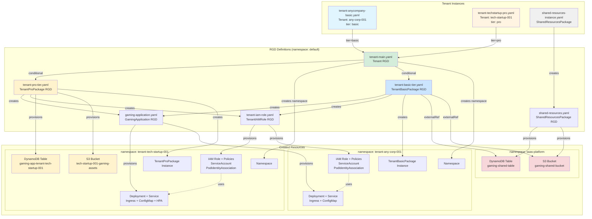

## Architecture Diagram



### Basic Tier Flow
```
tenant-anycompany-basic.yaml (Tenant)
  ↓
tenant-main.yaml (Tenant → Namespace + TenantBasicPackage)
  ↓
tenant-basic-tier.yaml (TenantBasicPackage → TenantIAMRole + GamingApplication)
  ├─→ externalRef → S3 Bucket (saas-platform namespace)
  ├─→ externalRef → DynamoDB Table (saas-platform namespace)
  ├─→ tenant-iam-role.yaml (TenantIAMRole → IAM Resources + ServiceAccount)
  └─→ gaming-application.yaml (GamingApplication → K8s Workload Resources)
```

### Pro Tier Flow
```
tenant-techstartup-pro.yaml (Tenant)
  ↓
tenant-main.yaml (Tenant → Namespace + TenantProPackage)
  ↓
tenant-pro-tier.yaml (TenantProPackage → S3 + DynamoDB + TenantIAMRole + GamingApplication)
  ├─→ S3 Bucket (dedicated, tenant namespace)
  ├─→ DynamoDB Table (dedicated, tenant namespace)
  ├─→ tenant-iam-role.yaml (TenantIAMRole → IAM Resources + ServiceAccount)
  └─→ gaming-application.yaml (GamingApplication → K8s Workload Resources + HPA)
```